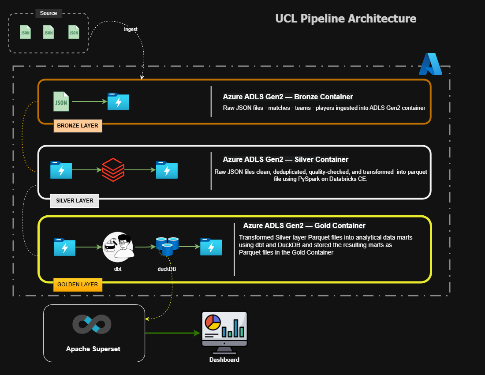

# UCL Analytics Pipeline 🏆

> An end-to-end production-style data engineering pipeline built on UEFA Champions League data — covering ingestion, transformation, modelling, and interactive analytics dashboards.

[](https://python.org)
[](https://spark.apache.org)
[](https://getdbt.com)
[](https://duckdb.org)
[](https://azure.microsoft.com)
[](https://superset.apache.org)
[](https://www.databricks.com/learn/free-edition)

## 🏗️ Architecture

This project follows a **medallion architecture** — a layered data design pattern used widely in production data platforms (Databricks, Snowflake, Microsoft Fabric all use this exact pattern). Data moves through three progressively refined layers: **Bronze** (raw), **Silver** (cleaned), and **Gold** (analytics-ready).



**Why medallion architecture, and not a single-step pipeline?**

A single-step pipeline (source → final table) is fast to build but brittle — if a transformation breaks, you lose your only copy of clean data, and you can't audit what changed at which stage. Medallion architecture solves this by keeping raw data immutable in Bronze, applying quality logic only in Silver, and reserving Gold purely for business-ready aggregates. This means:

- **Bronze is replayable** — if a downstream bug is found, I can re-run Silver and Gold from the original raw data without re-hitting the API
- **Silver is the single source of truth** — every Gold mart traces back to the same cleaned dataset, so standings and player stats can never contradict each other
- **Gold is disposable** — mart tables can be dropped and rebuilt instantly from Silver, since all business logic lives in version-controlled dbt SQL, not in the data itself

This is the same separation of concerns you'd find in a real data engineering team, where ingestion engineers, transformation engineers, and analytics engineers often work on different layers without stepping on each other.

## 🛠️ Tech Stack

| Layer                        | Technology                            | Why This Choice                                                                                         |
| ---------------------------- | ------------------------------------- | ------------------------------------------------------------------------------------------------------- |
| **Ingestion**                | Python 3.13, `azure-storage-blob` SDK | Direct blob upload without needing Databricks DBFS mount, which Databricks CE Serverless blocks         |
| **Storage**                  | Azure ADLS Gen2 (Free Tier)           | Industry-standard cloud data lake; hierarchical namespace mirrors real enterprise setups                |
| **Processing**               | PySpark on Databricks CE Serverless   | Distributed processing engine used at virtually every data engineering job; CE tier is free             |
| **Transformation Modelling** | dbt Core 1.7 + dbt-duckdb adapter     | SQL-based, version-controlled, testable transformations — the modern standard for analytics engineering |
| **Query Engine**             | DuckDB                                | Embedded OLAP engine; zero infrastructure cost, fast for analytical workloads on local Parquet/files    |
| **BI / Dashboarding**        | Apache Superset                       | Open-source BI tool used in production at companies like Airbnb and Lyft; not a toy tool                |
| **Version Control**          | Git + GitHub                          | Feature-branch workflow, conventional commits, PR-based merges                                          |

**A note on tool choices:** every tool here was selected to be genuinely free and production-grade simultaneously — not "free trial" tools that mimic real platforms. This was a deliberate constraint to prove the pipeline could be rebuilt at zero cost while still reflecting tools used in real data teams.

## 🎯 The Problem This Solves

Raw football data — whether from APIs or open datasets — comes scattered across multiple sources, inconsistent formats, and raw event-level granularity. A football analyst, fan, or fantasy-league player can't directly answer simple questions from this raw data without significant manual work:

- _Which teams are actually performing well right now, not just on paper?_
- _What are the team's form over the last 5 matches, not the whole season?_
- _Which players carry the most goal-scoring responsibility for their team?_

This pipeline answers exactly these three questions by transforming raw, fragmented data into three clean, queryable, dashboard-ready tables — turning a data engineering exercise into something with genuine analytical value.

## 📊 Dashboards

Three Apache Superset dashboards sit on top of the Gold layer, each answering one of the questions above.

### UCL Standings

League table with points, goal difference, win percentage, and points-per-game — answering _"who is actually winning?"_


### Team Form

Rolling 5-match form per team — points, goals scored vs conceded, and goal difference trend — answering _"who is in form right now?"_


### Top Scorers

Ranked goal leaderboard with top goal scorers and assists— answering _"who carries their team's attack?"_


## 📁 Project Structure

```
ucl-analytics-pipeline/
│
├── ingestion/                   # Bronze layer
│   ├── ingest_matches.py
│   ├── ingest_teams.py
│   ├── ingest_players.py
│   └── ingest_statsbomb.py
│
├── transformation/              # Silver layer
│   ├── 01_silver_matches.py
│   ├── 02_silver_teams.py
│   └── 03_silver_players.py
│
├── dbt_ucl/                     # Gold layer
│   ├── dbt_project.yml
│   ├── profiles.yml.example
│   ├── models/
│   │   ├── staging/
│   │   │   ├── stg_matches.sql
│   │   │   ├── stg_teams.sql
│   │   │   └── stg_players.sql
│   │   └── marts/
│   │       ├── ucl_standings.sql
│   │       ├── team_forms.sql
│   │       └── top_scorers.sql
│   └── schema.yml
│
├── utils/                       # Shared utilities
│   ├── config.py
│   ├── logger.py
│   ├── azure_client.py
│   ├── api_client.py
│   ├── download_silver.py
│   └── upload_gold.py           # Export Gold tables to Azure
│
├── docs/
│   ├── architecture.drawio      # Editable architecture file
│   ├── architecture.png         # Architecture diagram
│   ├── design_decisions.md      # Engineering decision log
│   └── screenshots/
│       ├── dashboards/          # Superset dashboard SC
│       └── azure-containers/    # Cloud proof — bronze/silver/gold
│
├── .env.example                 # Environment variable template (no secrets)
├── .gitignore
├── requirements.txt
└── README.md
```

## 🧠 Key Engineering Decisions

| Decision                                                | Problem It Solved                                                                                                             |
| ------------------------------------------------------- | ----------------------------------------------------------------------------------------------------------------------------- |
| `azure-storage-blob` SDK instead of DBFS mount          | Databricks CE Serverless blocks `dbutils.fs.mount()` and direct SparkContext access                                           |
| `row.asDict(recursive=True)` → Pandas → PyArrow BytesIO | JVM serialisation errors when writing Spark DataFrames directly to Parquet on CE Serverless                                   |
| dbt-duckdb adapter over Databricks SQL warehouse        | Databricks CE has no persistent SQL warehouse without a paid tier; DuckDB delivers the same modelling capability at zero cost |
| Apache Superset over Power BI / Tableau                 | Free tiers of Power BI/Tableau restrict public dashboard sharing; Superset is fully open-source and self-hostable             |
| Isolated Python 3.11 venv for Superset                  | numpy 1.26.x has no pre-built wheel for Python 3.13 on Windows, causing compiler-dependent build failures                     |

Each of these reflects a real constraint encountered mid-build, not a textbook decision — see [`docs/design_decisions.md`](docs/design_decisions.md) for the full reasoning log.

## ⚙️ Setup & Installation

### Prerequisites

- Python 3.13 (main project environment)
- Python 3.11 (required separately for Apache Superset — see note below)
- Azure account (Free Tier is sufficient)
- Databricks Community Edition account
- API-Football key (RapidAPI Free Tier)

> **Why two Python versions?** Superset's dependency chain includes numpy 1.26.x, which has no pre-built wheel for Python 3.13 on Windows. Rather than downgrade the entire project, Superset runs in an isolated Python 3.11 virtual environment. See [Key Engineering Decisions](#-key-engineering-decisions) for the full reasoning.

---

### 1. Clone the repository

```bash
git clone https://github.com/Saifi18/ucl-analytics-pipeline.git
cd ucl-analytics-pipeline
```

### 2. Set up the main environment

```bash
python -m venv venv
venv\Scripts\activate          # Windows
source venv/bin/activate       # Mac/Linux

pip install -r requirements.txt
```

### 3. Configure environment variables

```bash
cp .env.example .env
```

Open `.env` and fill in your own credentials:

> `.env` is gitignored — your credentials never leave your machine.

### 4. Run Bronze ingestion

```bash
python -m ingestion.ingest_matches
python -m ingestion.ingest_teams
python -m ingestion.ingest_players
python -m ingestion.ingest_statsbomb
```

### 5. Run Silver transformation

Upload the `transformation/` notebooks to Databricks Community Edition and run them in order:

### 6. Build the Gold layer with dbt

```bash
cd dbt_ucl
dbt run
dbt test
```

### 7. Launch Apache Superset (separate Python 3.11 environment)

```bash
py -3.11 -m venv venv-superset
venv-superset\Scripts\activate

pip install apache-superset duckdb-engine

set SUPERSET_CONFIG_PATH=path\to\superset_config.py
superset db upgrade
superset fab create-admin
superset init
superset run -p 8088 --with-threads
```

Open `http://localhost:8088`, connect the `ucl_gold.duckdb` file as a database, and the three pre-built dashboards will be available once datasets are registered.

## 🚀 Future Improvements

This project intentionally prioritized demonstrating core data engineering competencies under a zero-cost constraint. With production infrastructure and more time, the following would be the next investments:

- **Orchestration** — Replace manual script execution with Apache Airflow or Prefect to schedule, monitor, and retry pipeline runs automatically
- **Containerization** — Dockerize the ingestion and dbt layers so the entire pipeline is reproducible on any machine without Python version conflicts
- **Testing coverage** — Expand dbt tests beyond `not_null`/`unique` to include `relationships` tests across all staging-to-mart joins, plus Python unit tests for ingestion scripts
- **CI/CD** — Add a GitHub Actions workflow to run dbt tests automatically on every pull request
- **Incremental models** — Convert dbt mart models from full-refresh to incremental materialization to handle growing historical data efficiently
- **Real-time ingestion** — Move from batch ingestion to a streaming pattern (e.g. Azure Event Hubs) for live match data during active UCL fixtures
- **Cloud-hosted Superset** — Deploy Superset on a free-tier cloud VM so dashboards are publicly viewable without running locally

## 👤 Author

**Saifi** -
Aspiring Data Engineer · Python · PySpark · dbt · Azure · Databricks · SQL · NoSQL

[GitHub](https://github.com/Saifi18) · [LinkedIn](www.linkedin.com/in/md-saifi-israr)

---

⭐ If you found this project useful or interesting, consider starring the repo!
